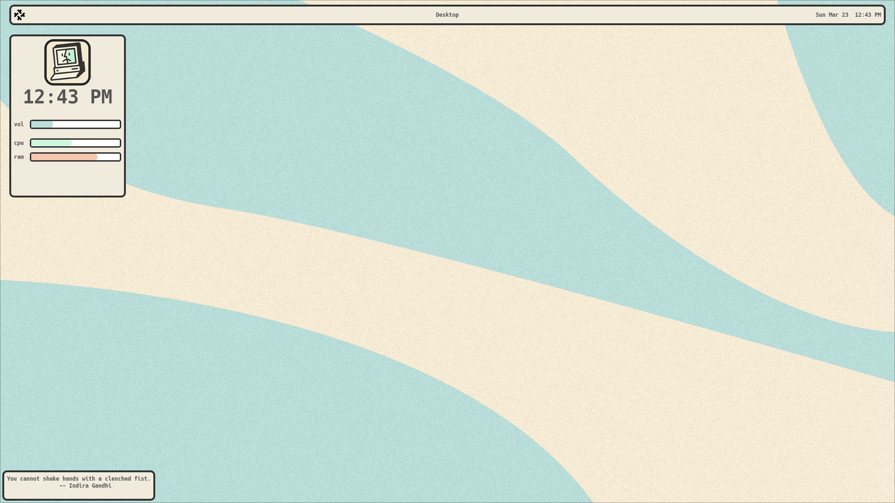
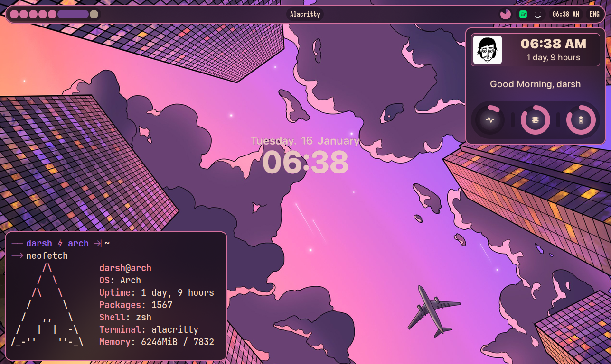
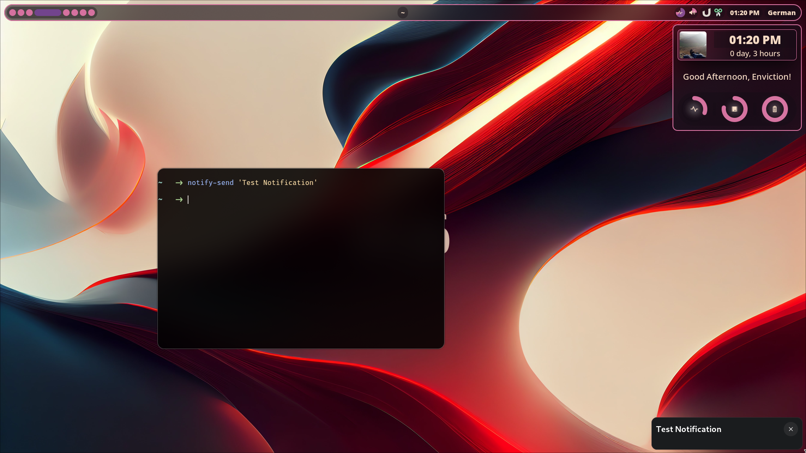

# Fabric Example Widgets

A collection of example widgets/rice's/snippets for Fabric

## About

This is a repository of example widgets for Fabric. Here you can find useful snippets, innovative widgets, and beautiful desktops. This repository is open source and free to use.

## Contents

* **Full Desktops**
  * [Organicpaper](./full-desktops/organicpaper/)
    * Inspired by [ChocolateBread's dotfiles](https://github.com/ChocolateBread799/dotfiles/tree/099a9a63fa4d3a105ed1e3254d31ca3264c413d7)
  
  * [Fabric Sugarcoat](./full-desktops/fabricsugarcoat/)
    * This is the original [Fabric example](https://github.com/Fabric-Development/fabric/tree/main/examples)
  
  
* **Widgets**
  * [Fabric Examples](./widgets/fabricexamples/)
    * App Launcher (A simple app launcher)
    * Bar (A fully fledged top panel)
    * Bluetooth Widget (A bluetooth manager widget)
    * Desktop Widget (A clock for the desktop)
    * Icon Browser (A browser for your gtk theme's icons)
    * Notifications (A Notification manager)
    * Side Panel (A dashboard-like widget showing information about your system)

## Acknowledgements

* [ChocolateBread](https://github.com/ChocolateBread799) - Original author of the now called rice, `Organicpaper`. Which was originally an Awesomewm rice
* [Fabric](https://github.com/Fabric-Development/fabric) - The next-generation framework for building desktop widgets using Python
* **You?** if you want to be on this list, contribute, and I'll be happy to add you to the list

## Contributing

If you have a simple widget, useful snippet or an example shell, and want to share it with beginners, or for inspiration, please submit a pull request.

## License

MIT
